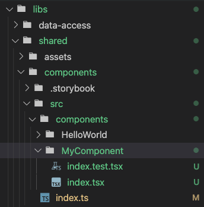

# Frontend Stack

# Table of contents

- [Used of Technologies](#used-of-technologies)
- [Getting Started](#getting-started)
- [Folder Structure](#folder-structure)
- [Assets](#assets)
- [Translation](#translation)
- [Theme](#theme)
- [Error Boundaries](#error-boundaries)
- [GraphQL CodeGen](#graphQL-codeGen)
- [Create Reusable Components](#create-reusable-components)
- [Linting](#linting)
- [Learn](#learn)
- [About Us](#about-us)

<!-- - [Reusable Components](#reusable-components) -->
<!-- - [Testing](#testing) -->
<!-- - [Deploy](#deploy) -->

---

# Used of Technologies

1.  Build System - `NX`
2.  Coding styles - `TypeScript`
3.  UI styles - `styled-components`
4.  UI Framework - `AntDesign` (cms), `Tailwind` (cms, web, mobile)
5.  Coding Practice - `Eslint` rules for `(.ts, .tsx)`
6.  API Integration - `GraphQL (with codegen)`

---

# Getting Started

1. Install dependencies `yarn`
2. Run development server
3. Start coding

```bash
# to install dependencies
yarn
# or
yarn install
```

## Available commands:

### CMS/Web Project

```bash
# to start `cms`/`web` development server
$ yarn cms:dev
$ yarn web:dev

# to run `cms`/`web` end to end test
$ yarn cms:e2e
$ yarn web:e2e

# execute production build for `cms`/`web` project
$ yarn build:cms
$ yarn build:web

# start production server for `cms`/`web` project
$ yarn run:cms
$ yarn run:web
```

### Mobile

```bash
# to start metro bundler
$ yarn mobile:dev

# to run project in ios simulator
$ yarn mobile:ios

# to run project in android emulator
$ yarn mobile:android

# to build project for e2e testing
$ yarn mobile:e2e:build
$ yarn mobile:e2e:build:ios
$ yarn mobile:e2e:build:android

# to run project e2e testing
$ yarn mobile:e2e:run
$ yarn mobile:e2e:run:ios
$ yarn mobile:e2e:run:android

# to generate apk (do not use this to send to client, for internal use only)
$ yarn mobile:generate-apk

# to generate icon automatically for project (refer mobile/project.json to check or modify the icon path )
$ yarn mobile:generate-icon

# to rename mobile app (name and identifier is a must, identifier will be used for both platform)
$ yarn mobile:rename --name=YOURNAME --identifier=com.xxx.xxx

# to run test for mobile project
$ yarn mobile:test

```

### Miscellaneous

```bash

# to generate GraphQL Types, Docs, Hooks, etc
$ yarn generate:graphql

# generate shared ui components (React Native)
$ yarn generate:component [componentName]

# to view theme configuration (tailwind)
$ yarn theme:viewer

# to fix translation locale files
$ yarn locale:fix

# to run prettier
$ yarn format

# to view dependency graph
$ yarn dep

# to commit
$ yarn cz

# to connect to services such as reactotron, android device remotely
$ yarn adb

# ======== Linting - to run eslint rules check
$ yarn lint # run for all projects & packages
$ yarn lint:cms
$ yarn lint:web
$ yarn lint:mobile
```

If you wish to install/remove dependencies into projects, you can use command below

```bash
# to install dependencies
# for mobile, after package installed, please modify mobile/package.json example : "mobx": "*"
yarn add <DEPENDENCIES>

# to remove dependencies
yarn remove <DEPENDENCIES>
```

---

# Folder Structure

```
├── apps
│    ├── cms # cms panel
│    ├── mobile # end user mobile application
│    └── web # end user web application
└── libs
    ├── data-access # GraphQL Types, Documents, Hooks, etc
    ├── shared # Translation locale files
    │     ├── assets # Shared assets (images, locales)
    │     └── components # Shared React Native UI Components
    └── ui-theme # theme configuration accross projects
```

---

# Assets

If you have common assets that want to shared across projects & packages, please add assets under folder `libs/shared/assets`. Then you can import your preferred assets with below example

```TypeScript
// In web & cms project
import logo from "frontend-stack/shared/assets/images/logo-brand.png";


// In react native project
import { Image } from "react-native";

const logo = require("frontend-stack/shared/assets/images/logo-brand.png");
<Image source={logo} />

```

---

# Translation

This monorepo has come with two language translation by default and translation files are located under folder `libs/shared/assets/src/locales`.
you may refer to the folder structure below & feel free to make changes

You can have multiple locale files (JSON) within a language folder.These files shared among `cms`, `web` & `mobile` projects.

```
├── cn
│   ├── common.json
│   └── screen.json
└── en
    ├── common.json
    └── screen.json

```

We've provided a basic example below & this is how each JSON file should looks like.

```JSON
{
  "some-variable": "Using a variable {{message}}",
  "title": "Hello world",
}
```

**Note**: Please follow the ascending order for the key (A-Z, from top to bottom). You may use `yarn locale:fix` command for the fixes automatically

### Example

For `cms` & `web` project, you may refer the example below or checkout out [next-translate](https://github.com/vinissimus/next-translate) for more information.

```TypeScript
import setLanguage from "next-translate/setLanguage";
import useTranslation from "next-translate/useTranslation";

export default function SomeComponent() {
  const { t, lang } = useTranslation("common");

  return (
    <>
      <div>{t("language")}: {t(`language-${lang}`)}</div>
      <div>{t("poweredBy")}</div>
      <div>{t("some-variable", { message: "Hey" })}</div>

      {/* Switch Language */}
      <button onPress={() => setLanguage("en")}>
        {t("language-en")}
      </button>
      <button onPress={() => setLanguage("cn")}>
        {t("language-cn")}
      </button>
    </>
  );
}
```

For `mobile` projects, you can refer to the example below

```TypeScript
import { Text, Button } from "react-native";
import { useTranslation } from "i18n"; // <--- always import from "i18n"

export default function SomeComponent() {
  const { t, lang, setLanguage } = useTranslation("common");

  return (
    <>
      <Text>{t("language")}: {t(`language-${lang}`)}</Text>
      <Text>{t("poweredBy")}</Text>
      <Text>{t("some-variable", { message: "Hey" })}</Text>

      {/* Switch Language */}
      <Button onPress={() => setLanguage("en")} title={t("language-en")} />
      <Button onPress={() => setLanguage("cn")} title={t("language-cn")} />
    </>
  );
}
```

If you've noticed, the interface for the translation actually is quite similar for both `react` & `react-native` projects. But there are certains thing you guys have to take note

1. For `react-native` project (mobile) always import from `"i18n"`
2. For `react` projects (web, cms) please refer to [next-translate](https://github.com/vinissimus/next-translate) documentation or example above
3. You can always use `setLanguage` method to switch language, but there is some differences on implementation. Please checkout the example below:

```TypeScript
// in react project (web & cms)
import setLanguage from "next-translate/setLanguage";

const YourComponent = () => {
  const onPressButton = () => {
    setLanguage("en");
  }

  return <button onClick={onPressButton}>ENGLISH</button>
}

// in react-native project (mobile)
import { useTranslation } from "i18n";

const YourComponent = () => {
  const { t, lang, setLanguage } = useTranslation(); // use this hooks within component

  const onPressButton = () => {
    setLanguage("en");
  }

  return <Button onPress={onPressButton} title="ENGLISH" />
}
```

Checkout table below comparison

| Variable/Function        | Description                       | Web & CMS                                                                             | Mobile                                                       |
| ------------------------ | --------------------------------- | ------------------------------------------------------------------------------------- | ------------------------------------------------------------ |
| `t` (function)           | A function to get translated text | access via `useTranslation` react hooks (import from `next-translate/useTranslation`) | access via `useTranslation` react hooks (import from `i18n`) |
| `lang` (string)          | Current language                  | Same as above                                                                         | Same as above                                                |
| `setLanguage` (function) | A function for language switching | import from `next-translate/setLanguage`                                              | Same as above                                                |

---

# Theme

This monorepo enabled theme configuration accross packages & projects. There were predefined setting under `libs/ui-theme` folder and below is the folder structure

```
├── src
│   └── index.ts # helper function for get tailwind styles with css name
└── tailwind.config.js # tailwind configuration
```

## Tailwind

For tailwind theme configuration, you may update `tailwind.config.js` under `libs/ui-theme` folder. This configuration will be shared with other project that has enabled tailwind.
If you wish to have advanced configuration, please checkout the [official documentation](https://tailwindcss.com/docs/configuration) for customization.

**Note**:

1. Only put general configuration under `libs/ui-theme/tailwind.config.js` as this configuration shared to ReactNative project as well.
2. If you have configuration specifically for web/cms project, please proceed to project folder. eg: `apps/web/tailwind.config.js`
3. You can always run `yarn theme:viewer` to view theme configuration.

### Example

To apply tailwind style for `react` or `react-native` project, you can do something like below:

```TypeScript
// in react-native project use `@frontend-stack/ui-theme` for styling
import { View, Text } from "react-native";
import { tw } from "@frontend-stack/ui-theme";

<View style={tw("bg-primary")}>
  <Text>View with primary color background</Text>
</View>

// if you are working on web related project, just do as simple like below
<div className="bg-primary">
  View with primary color background
</div>
```

### Caveat:

1. Certain css might not supported for `React Native`, please checkout the [repo](https://github.com/jaredh159/tailwind-react-native-classnames) for more information

---

# Error Boundaries

Error boundaries is the React way to handle errors in your application. It lets you react and recover from runtime errors as well as providing a fallback user interface if applicable.
If you would like to further understand here is the reference [link](https://blog.openreplay.com/catching-errors-in-react-with-error-boundaries) for more information.

In this monorepo we're using [react-error-boundary](https://github.com/bvaughn/react-error-boundary) for handle error in react application.

### Example

Below is the basic usage simulate the error

```TypeScript
import React, { useEffect } from 'react';
import { ErrorBoundary } from 'react-error-boundary';

// this component will throw error during mounted
const ComponentThatMayError = () => {
  useEffect(() => {
    throw new Error('Test error');
  }, []);
  return null;
};

// this component is the fallback view
const ErrorFallbackView = ({ error, resetErrorBoundary }) => {
  return (
    <div role="alert">
      <p>Something went wrong:</p>
      <pre>{error.message}</pre>
      <button onClick={resetErrorBoundary}>Try again</button>
    </div>
  );
}

// this is the actual implementation with above components
const SomeScreenOrComponent = () => {
  return (
    <div>
      <p>This is demo</p>
      <ErrorBoundary
        FallbackComponent={ErrorFallbackView}
      >
        <ComponentThatMayError />
      </ErrorBoundary>
    </div>
  );
}
```

---

# GraphQL CodeGen

First step is change the schema url to your development server at `./libs/data-access/.codegen.yml`

```yml
schema: 'http://localhost:3000/graphql'
```

Second step find the operations file at `./libs/data-access/src/operations/index.graphql` and modify it, for example

```GraphQL
fragment UserInfo on User {
  id
  email
  firstName
  lastName
  phoneCode
  phoneNumber
  referralCode
}

query getAuthProfile {
  getAuthProfile {
    ...UserInfo
  }
}
```

Third Step is to generate the GraphQL Types, Documents, Hooks by running the command `yarn generate:graphql`


Fourth Step is to import any of Types, Documents, Hooks to your components or the places you wants to use it

```TypeScript
import { useAdminSignInMutation } from '@frontend-stack/data-access';

const ExampleComponent = () => {
  const [signin] = useAdminSignInMutation();

  const onSubmit = ({ email, password }) => {
    signin({
      input: {
        email,
        password
      }
    })
  }

  return (
    <form onSubmit={onSubmit}>
      {/* Your view goes here */}
    </form>
  );

}
```

---

# Create Reusable Components

Reusable components are those React components that can be used multiple times in application/projects.
With this setup, all the reusable components should placed under `libs/shared/components/src/components` folder in order to get all the projects within this setup are able to access to it.

To create a reusable component you can run the command below

```bash
$ yarn generate:component [componentName]
```


The generated component should appeared in `libs/shared/components/src/components` folder upon success. You can proceed to the component and make modification anytime after the generation process is done.

### Note:

1. The command will generated a `React Native` component
2. Be aware that the generated component folder & file naming convention is not tally with our coding practices standards. Do proceed to rename the folder & file manually
3. Remember to update component export in `libs/shared/components/src/index.ts` once above step is done

| Generated Component                                    | Rename Generated Component                                  |
| ------------------------------------------------------ | ----------------------------------------------------------- |
|  |  |

### Caveat:

1. Try not to include platform specific code/package for component, as component should works well in other web & mobile environment. Example:
   1. Request reading contact list permission
   2. Import package that is not support for web/mobile environment
2. If there is occasional/special case that require to have platform specific support. You always able to create another component with different extension under the same generated component folder.
   1. `.web.tsx`
   2. `.ios.tsx`
   3. `.android.tsx`
   4. `.mobile.tsx`

### Example Usage

```TypeScript
import { MyComponent } from '@frontend-stack/shared/components';

const ExampleUsage = () => {
  return (
    <div>
      <MyComponent />
    </div>
  )
}

```

---

# Linting

Linting is important to reduce errors and improve the overall quality of code & it helps to accelerate development and reduce costs by finding errors earlier.

Here’s how lint tools are typically fit into the development process.

1. Write the code.
2. Compile it.
3. Analyze it with the linter.
4. Review the bugs identified by the tool.
5. Make changes to the code to resolve the bugs.
6. Link modules once the code is clean.
7. Analyze them with the linter.
8. Do manual code reviews.

Lint programming is a type of automated check. It should happen early in development, before code reviews and testing. That’s because automated code checks make the code review and test processes more efficient.

The current setup was leverage on [ESLint](https://eslint.org/) to automated the process during development process. You also do lint check manually by running the commands below

```bash
$ yarn lint # for all projects
$ yarn [target]:lint # to target specific project

# to fix the linting issue
$ yarn lint --fix
$ yarn [target]:lint --fix # to target specific project
```

**Note**: Be aware that `--fix` options wouldn't help to fix everything automatically, you would need to resolve some of the errors manually

<!-- ---

# Deploy

1. Install vercel cli.
2. Authenticate your vercel account (tools@lavax.co)

```bash
# to deploy cms to vercel
yarn deploy:cms

# deploy cms to production
yarn deploy:cms --prod

# or deploy web
yarn deploy:web

# deploy web to production
yarn deploy:web --prod
```

## Setup vercel deployment (first time only)

note: change the `xxx` according to your project folder structure.

1. run `vercel` then setup the project. After that copy the .vercel folder into the respective `projects/xxx` folder.
2. change the 'scripts' in package.json to allow shortcut such as `"deploy:xxx": "cp -rf ./projects/xxx/.vercel ./ && vercel"`.
3. note: make sure you commit the code into the git repo. so the next person can just quickly run the command to deploy. -->

---

# Learn

### NX

Visit the [Nx Documentation](https://nx.dev) to learn more.

### React Native

A framework for building native apps using React. For more information please checkout [official documentation](https://reactnative.dev/)

### Ant Design

An enterprise-class UI design language and React UI library with a set of high-quality React components, one of best React UI library for enterprises. For more infomation please checkout the [official documentation](https://ant.design/components/overview/).

### Tailwind Css

A utility-first CSS framework for rapid UI development. For more infomation & details please checkout the [official documentation](https://tailwindcss.com/docs).

Oh Wait! There are some awesome references for UI components as well

1. https://tailwindui.com/components
2. https://tailblocks.cc/
3. https://tailwindtemplates.io/
4. https://component.tailwindow.com/
5. https://www.tailwindtoolbox.com/
6. https://tailwindcomponents.com/

### Styled Component

1. Official Docs - https://styled-components.com/
2. Github - https://github.com/styled-components/styled-components

---

# About US

Check out our company profile [LavaX Technologies Sdn Bhd](https://lavax.co) and welcome to reach out for inquires.
