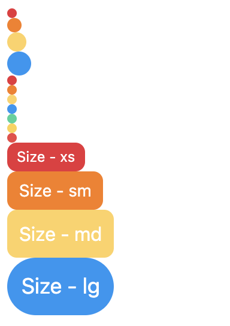

# Props

```TypeScript
import { StyleProp, TextStyle, ViewStyle } from "react-native";
import { StyleType, ViewSizing } from "../../@types";

export type Props = {
  className?: string;
  textClassName?: string;
  containerClassName?: string;
  size?: ViewSizing;
  type?: StyleType;
  text?: string;
  rounded?: boolean;
  textColor?: string;
  backgroundColor?: string;
  style?: StyleProp<ViewStyle>;
  textStyle?: StyleProp<TextStyle>;
  containerStyle?: StyleProp<ViewStyle>;
  onPress?: (...args: any[]) => any;
};
```

# Default Value

```TypeScript
{
  size: "xs",
  type: "primary",
  rounded: false
}
```

# Preview



# Example

```TypeScript
import { Badge } from "@ui/native";

<Badge size="xs" type="primary"/>
<Badge size="sm" type="secondary"/>
<Badge size="md" type="accent"/>
<Badge size="lg" type="info" />

<Badge type="primary" />
<Badge type="secondary" />
<Badge type="accent" />
<Badge type="info" />
<Badge type="success" />
<Badge type="warning" />
<Badge type="error" />

<Badge size="xs" type="primary" text="Size - xs" />
<Badge size="sm" type="secondary" text="Size - sm" />
<Badge size="md" type="accent" text="Size - md" />
<Badge size="lg" type="info" text="Size - lg" />

```
